# Global Deforestation Analysis


## Introduction 
This SQL project tackles global deforestation trends and aims to uncover valuable environmental insights using advanced SQL techniques.
I will be working with three separate CSV datasets: Forest_Area, Land_Area, and Regions, each containing three relevant columns. By analyzing these datasets through SQL queries, I will be identifying critical patterns and geographical trends in deforestation.
This information will be instrumental in making informed decisions for sustainable forestry practices and overall environmental management.

## Problem Questions: 
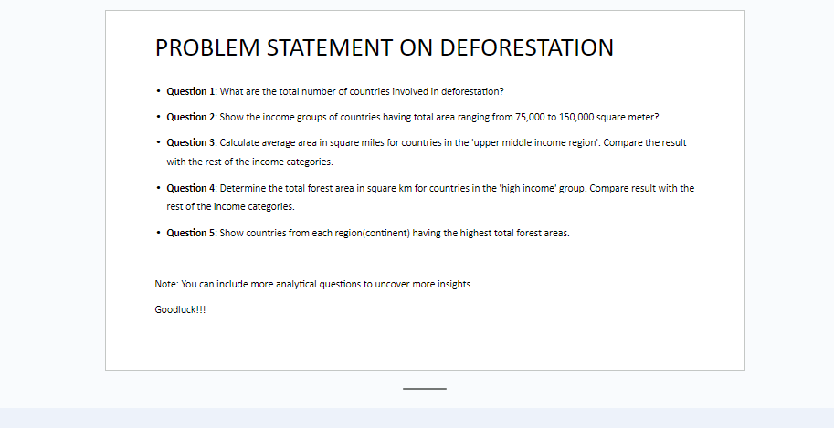 
----

## Skills  and Concepts Demonstrated
#### Demonstrated skills by utilizing the following SQL syntax and functions
- CREATE, and USE DATABASE
- SELECT, FROM, WHERE
- UPDATE, ROUND, SET
- GROUP BY, HAVING, ORDER BY
- AVG, COUNT, DISTINCT, SUM
- NULL, IS NULL, ON
- AS, JOIN
- DENSE RANK, OVER, PARTITION BY
- COMMON TABLES EXPRESSION (CTE), SUBQUERIES

## Data Wangling Procedure
1. ### Creating the Project's Database
- I created the project's database and named it 'SQL_PROJECT' and ensured the database was selected.

*CODE USED:*
```
CREATE DATABASE SQL_PROJECT;
USE SQL_PROJECT;
```

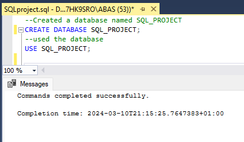
----

2. ### Imported Dataset
- Three different .csv files named "Forest_Area", "Land_Area", and "Regions" were imported.
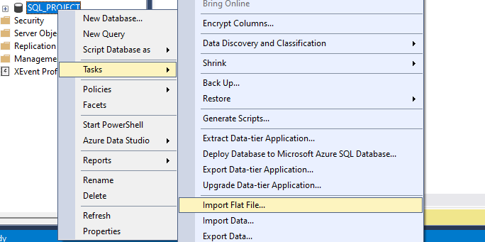
-----
3. ### Retrive Data from the Datasets

*CODE USED:*
   ```
SELECT * FROM [dbo].[Forest_Area];
SELECT * FROM [dbo].[Land_Area];
SELECT * FROM [dbo].[Region];
```
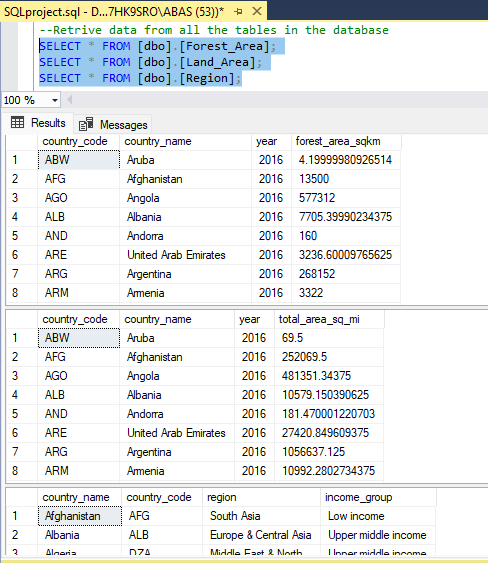

4. ### CHECKING FOR NULL VALUES
- Checking for NULL values in the forest_area and land_area tables
- In Forest_Area, null values were found in "FOREST_AREA_SQKM"
- In Land_Area, null values were found in "total_area_sq_mi"
- In Region, null values were found in income_group and was replaced with 'Unknown'

*CODE USED:*
```
SELECT *FROM [dbo].[Forest_Area]
WHERE FOREST_AREA_SQKM IS  NULL;
```
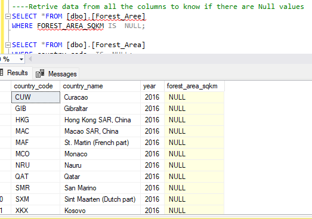

*CODE USED:*

```
SELECT * FROM [dbo].[Land_Area]
WHERE total_area_sq_mi IS NULL;
```
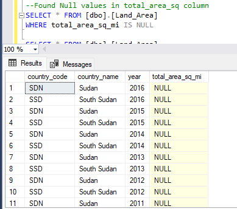

*CODE USED:*
```
SELECT * FROM [dbo].[Region]
WHERE income_group = 'Null';

UPDATE Region SET income_group =
CASE  WHEN income_group = 'NULL' THEN 'Unknown'
ELSE income_group
END;

SELECT * FROM [dbo].[Region]
WHERE income_group = 'unknown';

```
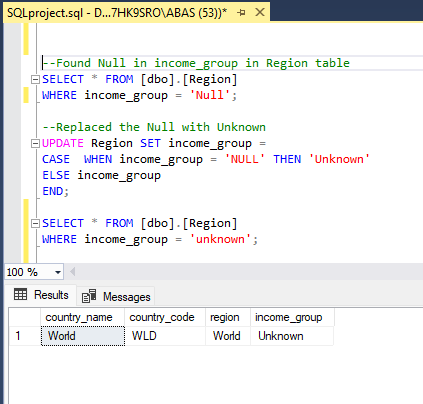

5. ### REPLACING NULL VALUES
- I calculated the average FOREST_AREA_SQKM for FOREST_AREA and used the average value to replace the NULL values in the column
- I calculated the average total_area_sq_mi for LAND_AREA and used the average value to replace the NULL values in the column
- In Region, null values were found in income_group and was replaced with 'Unknown' (This is show in no. 4)
- I ensured that the code has executed correctly by checking the columns again

*CODE USED:*
```
UPDATE FOREST_AREA SET FOREST_AREA_SQKM =
CASE  WHEN FOREST_AREA_SQKM  IS NULL THEN 391051.83952495
ELSE FOREST_AREA_SQKM
END;
```

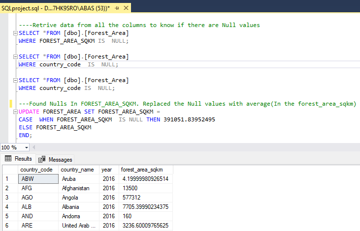

*CODE USED:*
```
UPDATE Land_Area SET total_area_sq_mi =
CASE  WHEN total_area_sq_mi  IS NULL THEN 457095.353337975
ELSE total_area_sq_mi
END;
```

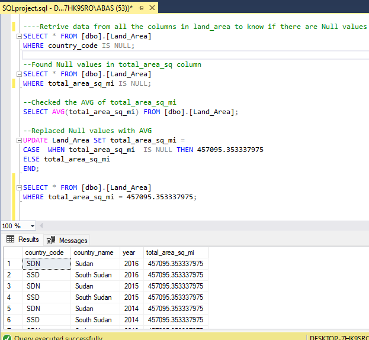

6. ### Joined the Three tables:
*CODE USED:*
```
SELECT * FROM Land_Area JOIN FOREST_AREA ON Land_Area.COUNTRY_CODE = Forest_Area.country_code
JOIN Region ON Land_Area.country_code = Region.country_code;
```
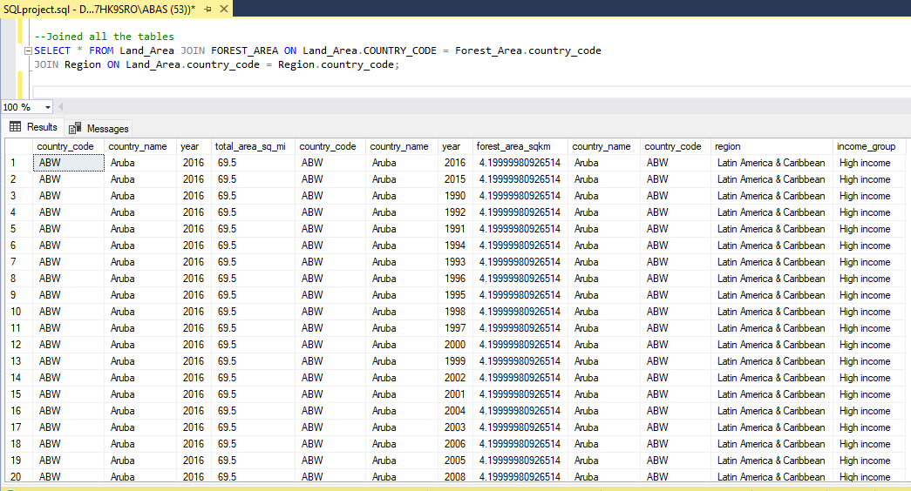

## Data Analysis and Insights generated
### Question 1: What are the total number of countries involved in deforestation?
- A total number of 219 coutries are involved in the deforestaion
- I used the DISTINCT and COUNT operators
*CODE USED:*
```
SELECT DISTINCT COUNT(COUNTRY_NAME) no_of_countries 
FROM Region;
SELECT DISTINCT country_name 
FROM Region;
```

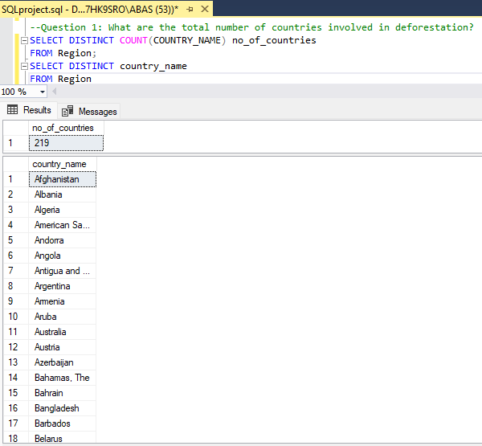

### Question 2: Show the income groups of countries having total area ranging from 75,000 to 150,000 square meter?
- To answer this question, since the income group and total area in square meter column are in two different tables ("Regions" and "Forest_area" tables), I joined the two tables together using a common key "country_code" column which is in both tables
- I used SELECT, ROUND, FROM, JOIN, ON, WHERE AND BETWEEN
- 682 countries's Income groups were shown having total area ranging from 75,000 to 150,000 square meter
- The income group of these countries range from high income, upper middle income, lower middle income and low income.

*CODE USED:*
```
SELECT income_group, Region.country_name, ROUND(total_area_sq_mi, 0) 
	FROM Land_Area 
	JOIN Region ON Land_Area.country_code = Region.country_code
	WHERE total_area_sq_mi BETWEEN 75000 AND 150000;
```
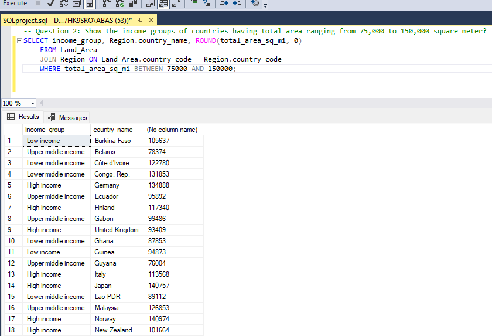

### Question 3: Calculate average area in square miles for countries in the 'upper middle income region'. Compare the result with the rest of the income categories.
- To answer this question, since the column which I will use to calculate average area in square miles (total_area_sq_mi) is in the Land_Area table and the income_group column is in the table Region, I joined the two tables together using a common key "country_code" column which is in both tables
- I used SELECT, ROUND, AVG, AS, FROM, JOIN, GROUP BY, HAVING, IN, ORDER BY
- I compared the result with the rest of the income categories which are 'High income', 'Low income', 'Lower middle income'
- The result shows that the 'upper middle income region' has the higest average area in square miles which is 383326 followed by High income with the value of 187168

*CODE USED:*
```
SELECT income_group, ROUND(AVG(total_area_sq_mi), 0) AS AVG_total 
FROM Land_Area
JOIN  Region ON Land_Area.country_code = Region.country_code
GROUP BY  income_group
HAVING income_group IN ('Upper middle income','High income', 'Low income', 'Lower middle income')
ORDER BY AVG_total DESC;
```

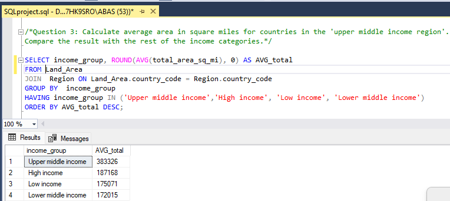

### Question 4: Determine the total forest area in square km for countries in the 'high income' group. Compare result with the rest of the income categories.
- To answer this question, since the column which shows forest area in square km(FOREST_AREA_SQKM) is in the Forest_Area table and the income_group column is in the table Region, I joined the two tables together using a common key "country_code" column which is in both tables.
- I used SELECT, ROUND, SUM, AS, FROM, JOIN, ON, GROUP BY, HAVING, IN
- I compared the result with the rest of the income categories which are 'Upper middle income', 'Low income', 'Lower middle income'
- The result shows that the 'high income region' has the total forest area in square km of 365003416 which is the second highest compared to other income groups

*CODE USED:*
```
SELECT income_group , ROUND(SUM(FOREST_AREA_SQKM),0) total_forest_area_sqkm FROM Forest_Area 
JOIN Region ON Forest_Area.country_code = Region.country_code
GROUP BY income_group 
HAVING income_group  IN ('Upper middle income','High income', 'Low income', 'Lower middle income');
```
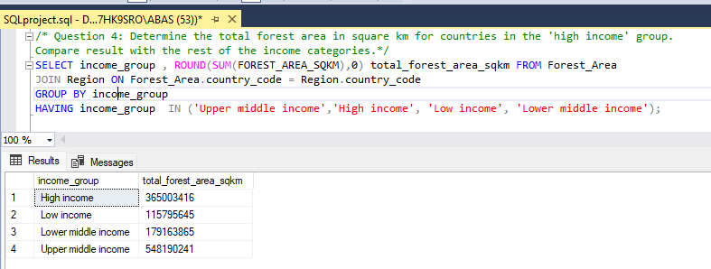

### Question 5: Show countries from each region(continent) having the highest total forest areas. 
- I analyse this insight using two tables - "Regions" and "Forest_area" tables as I will be looking at the region, country_name and forest_area_sqkm columns. This is to Show different countries from each region(continent) having the highest total forest areas.
- Therefore, I joined the two tables together using a common key "country_code" column which is in both tables. 
- I used the ROUND, SUM, AS, JOIN, ON, DESC, GROUP BY, ORDER BY, DENSE_RANK, OVER, PARTITION BY
- I also used aliasing (AS) to make referencing easier
- The result shows that countries with the highest total forest areas in different regions include: World, Russian Federation, Brazil, Canada, China, Congo, Dem. Rep., India, Qatar, With World being the overal highest.
*CODE USED:*

```
SELECT *
FROM 
	(
	SELECT Region.country_name, REGION, ROUND(SUM(forest_area_sqkm), 0) AS total_forest_area_sqkm ,
	DENSE_RANK () OVER (PARTITION BY REGION ORDER BY SUM(forest_area_sqkm)DESC) AS HIGHEST_FOREST_RANK
	FROM Forest_Area JOIN Region ON forest_area.country_code = Region.country_code
	GROUP BY region, Region.country_name
	) RANKED_FOREST	
WHERE HIGHEST_FOREST_RANK = 1
ORDER BY total_forest_area_sqkm DESC
```
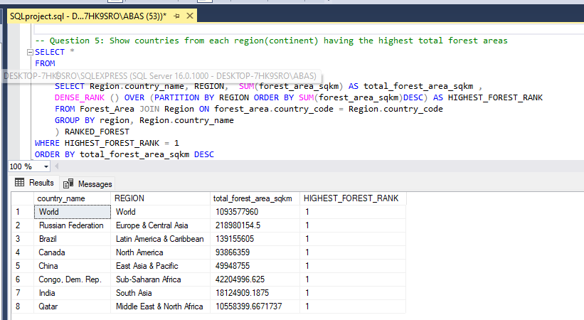

## More analytical questions to uncover more insights.
### Question 6: Show countries from each region(continent) having the lowest total forest areas. USING CTE
- To analyse this insight, I used Common Table Expression Method - With
- I used two tables - "Regions" and "Forest_area" tables as I will be looking at the region, country_name and forest_area_sqkm columns. This is to Show different countries from each region(continent) having the lowest total forest areas.
- Therefore, I joined the two tables together using a common key "country_code" column which is in both tables. 
- I used the ROUND, SUM, AS, JOIN, ON, DESC, GROUP BY, ORDER BY, DENSE_RANK, OVER, PARTITION BY, CTE
- I also used aliasing (AS) to make referencing easier
- The result shows that countries with the lowest total forest areas in different regions include: Faroe Islands, Malta, Aruba, Tuvalu, Bermuda, Maldives, Mauritius, World With Faroe Islands being the overal lowest.
*CODE USED:*
```
WITH FOREST_RANK AS (SELECT Region.country_name, region, ROUND(SUM(forest_area_sqkm), 0) AS TOTAL_FOREST_AREA, 
	DENSE_RANK() OVER(PARTITION BY region ORDER BY SUM(forest_area_sqkm)) AS LOWEST_FOREST_RANK
    FROM forest_area 
	JOIN Region ON Forest_Area.country_name = Region.country_name 
    GROUP BY Region.country_name, region)
	SELECT *
FROM FOREST_RANK
WHERE LOWEST_FOREST_RANK = 1
ORDER BY TOTAL_FOREST_AREA;
```
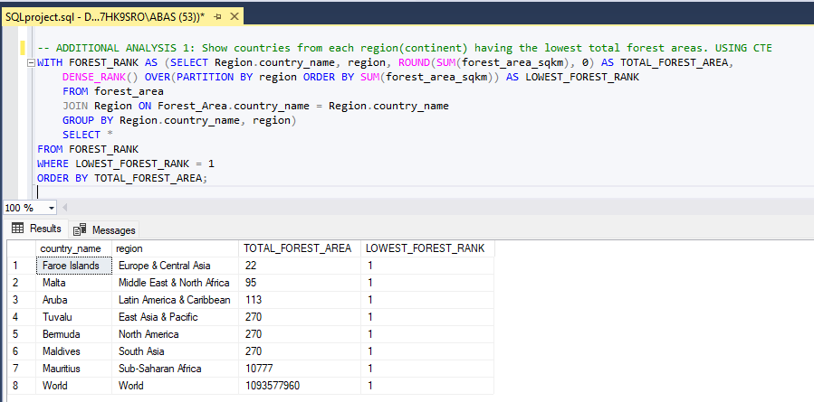

### Question7: What are the top 5 countries with the largest forest areas IN 2016?
- For this analysis, I used SELECT, TOP 5, FROM, JOIN, ON, GROUP BY, HAVING, ORDER BY, DESC
- I analysed this insight using two tables - "Regions" and "Forest_area" tables as I will be looking at the country_name, Year, and forest_area_sqkm columns. This is to Show countries with the largest forest areas IN 2016.
- Therefore, I joined the two tables together using a common key "country_code" column which is in both tables.
- The result shows that in the year 2016 the folling countries had the largest forest areas : World, Russian Federation, Brazil, Canada, United States, with world coming first with the total of 39958244 forest_area_sqkm

*CODE USED:*
```
SELECT TOP 5 Region.country_name, SUM(forest_area_sqkm) largest_forest_areas, year FROM Forest_Area
JOIN Region ON Forest_Area.country_code = Region.country_code
GROUP BY  Region.country_name , year
HAVING YEAR = '2016'
ORDER BY largest_forest_areas DESC
```
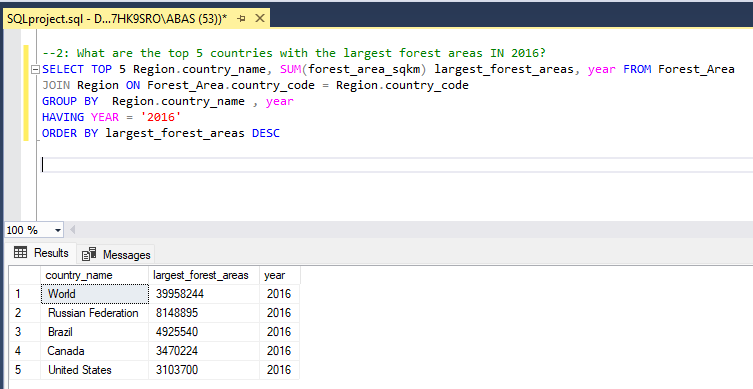

## Conclusion: 
- With the above I was able to answer the project questions asked and also provide insight to possible deforestation projects.
- Some countries possess a large forest area while others have very little. If we intend to clear the forest areas for infrastructural purposes, this insight can be helpful to know the right perpective and direction.

### *To interact with the project's SQL query, click [here](https://github.com/AbasimaEtim/SQL_Project/blob/main/SQLproject.sql)*
## The End 😊

