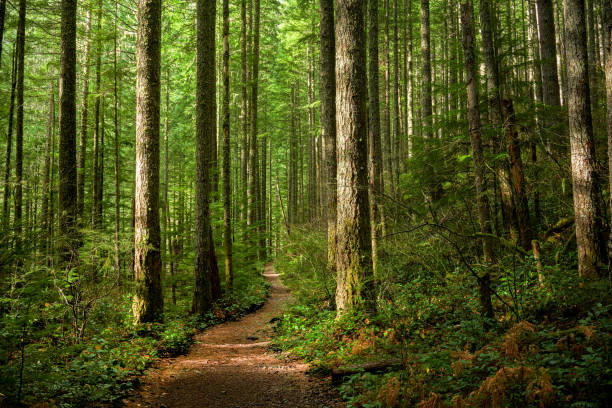

# Global Deforestation Analysis

## Introduction 
This SQL project tackles global deforestation trends and aims to uncover valuable environmental insights using advanced SQL techniques.
I will be working with three separate CSV datasets: Forest_Area, Land_Area, and Regions, each containing three relevant columns. By analyzing these datasets through SQL queries, I will be identifying critical patterns and geographical trends in deforestation.
This information will be instrumental in making informed decisions for sustainable forestry practices and overall environmental management.

## Problem Statment And Questions: 

